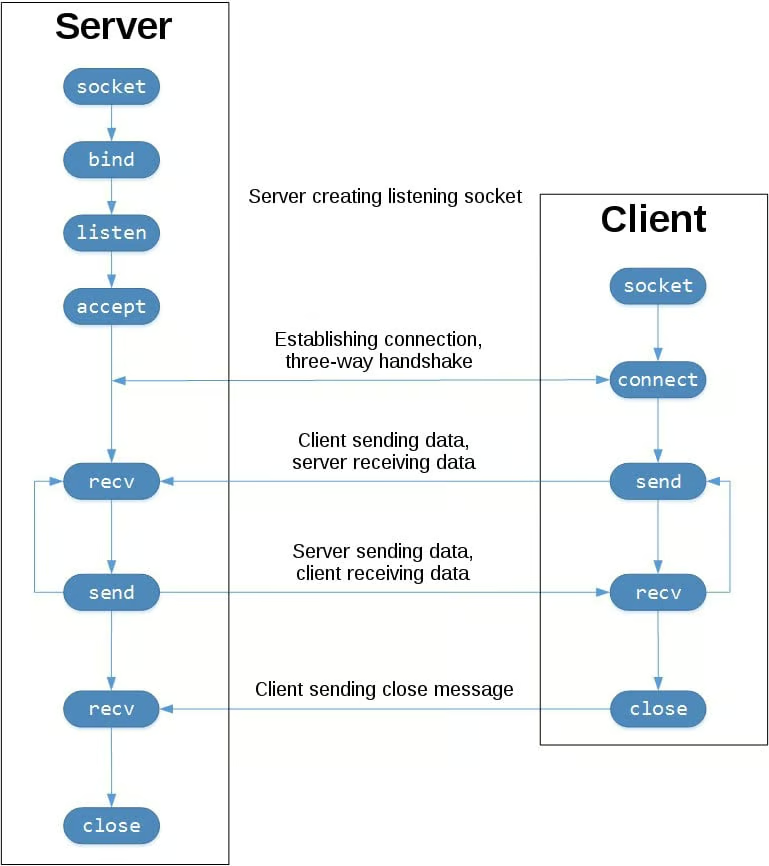

# Socket Programming
# Common Socket Functions

    socket()
    .bind()
    .listen()
    .accept()
    .connect()
    .connect_ex()
    .send()
    .recv()
	.close()

# Client-Server Model


# TCP Client
```python
#!/home/calypse/repos/python-networking/codes/bin/python3

# Setting up the target server's details
import socket
target_host = "www.example.com"
target_port = 80

# Create a Socket Object
client = socket.socket(socket.AF_INET, socket.SOCK_STREAM)
# socket.AF_INET = Standard IPv4 Address/hostname
# socket.SOCK_STREAM = TCP Client

# Connect the client to the server
client.connect((target_host, target_port))

# Send some data to the server
client.send(b"GET / HTTP/1.1\r\nHost: example.com\r\n\r\n")

# Receive Some Data
response = client.recv(4096)

print(response)
```

# Create A TCP Server
```python
#!/home/calypse/repos/python-networking/codes/bin/python3

import socket
import threading

# Setting up the IP and Port for the server to listen on
bind_ip = "0.0.0.0"
bind_port = 9999

# Create A Server Socket Object
server = socket.socket(socket.AF_INET, socket.SOCK_STREAM)
server.bind((bind_ip, bind_port))

# Specify the number of unaccepted connections that the system will allow before refusing new connections. 
server.listen(5)

print("[*] Listening on: %s:%d" % (bind_ip, bind_port))

# Client Handling Thread
def handle_client(client_socket):
	# Print out what the client sends
	request = client_socket.recv(1024)
	print("[*] Received: %s" % request)

	# Send Back a Packet
	client_socket.send(b"ACK!")
	client_socket.close()

while True:
	client, addr = server.accept() # client = client socket object
									# addr[0] = client ip
									# addr[1] = client port
	print("[*] Accepted Connection From: %s:%d" % (addr[0], addr[1]))

	# Spin Up Our Client Thread to Handle Incoming Data
	client_handler = threading.Thread(target=handle_client, args=(client,))
									# target -> the function the thread will run
									# args -> arguments passed to the function
	client_handler.start()
```


